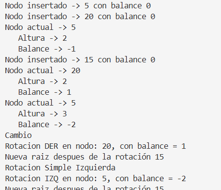

# Práctica de Estructuras

## 📌 Información General

- **Título:** Estructuras No Lineales
- **Asignatura:** Estructura de Datos
- **Carrera:** Computación
- **Estudiante:** Ivanna Nievecela
- **Fecha:** 19/06/2025
- **Profesor:** Ing. Pablo Torres

---

## 🛠️ Descripción 



---

## 🚀 Ejecución

Para ejecutar el proyecto:

1. Compila el código:
    ```bash
    javac App.java
    ```
2. Ejecuta la aplicación:
    ```bash
    java App
    ```
